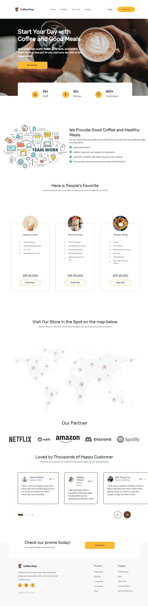
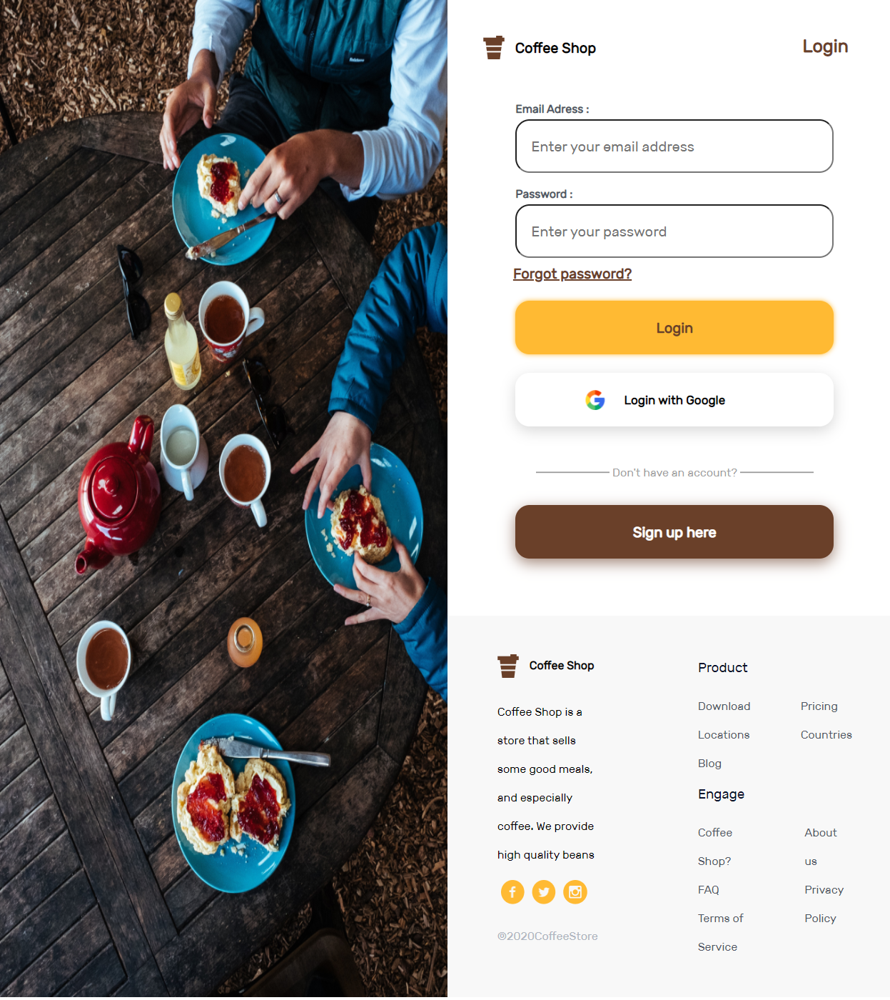
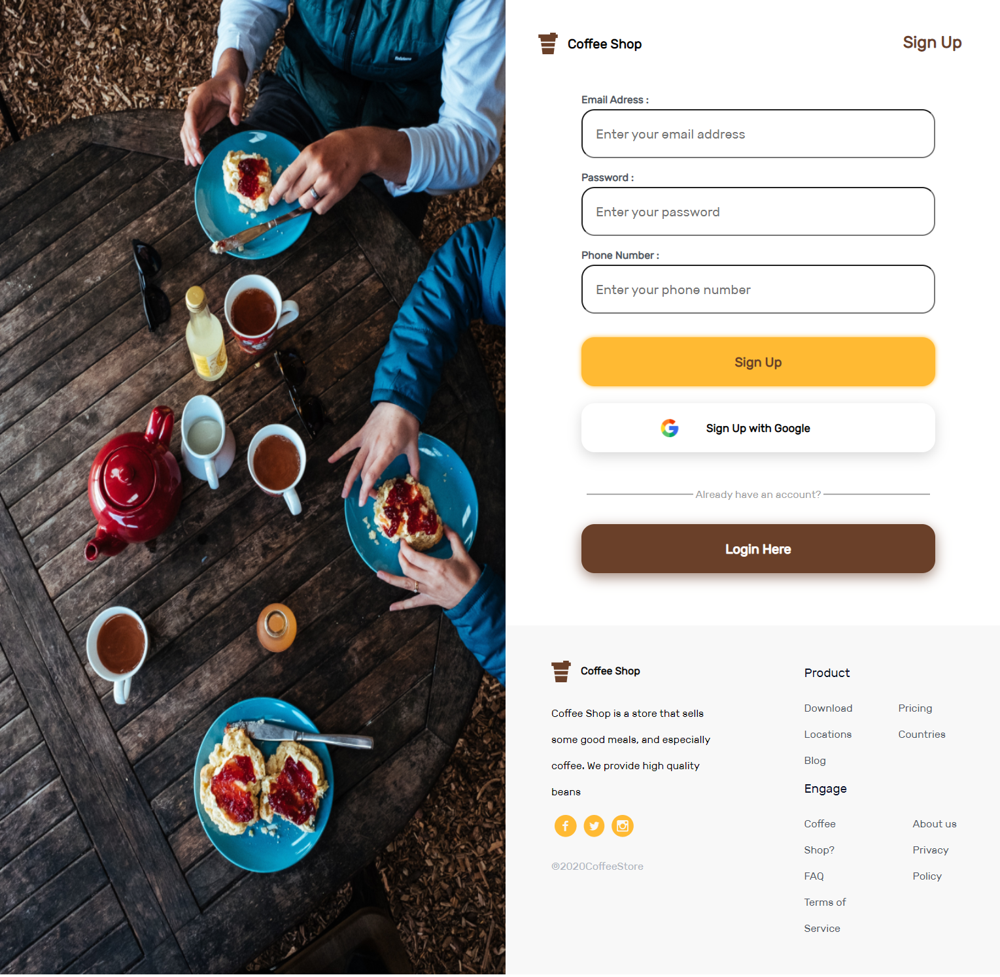
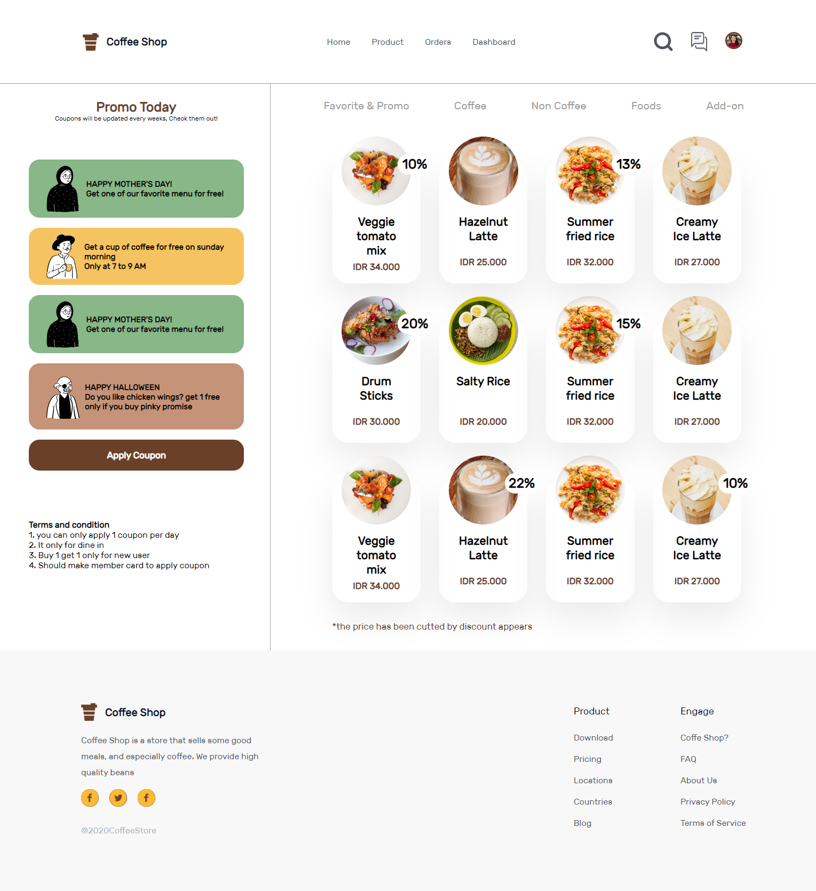
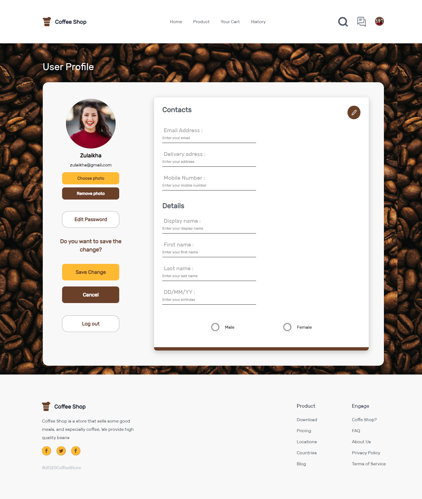

<a id="readme-top"></a>

<div align="center">
  <h2>Coffee Shop </u></h2>
</div>

<br>
<br>

# About The Project

<p>Coffee Shop is a store that sells some good meals, and especially coffee. We provide high quality beans</p>

<h2>Built With </h2>

<p>
  <a style="height: 48px; width:48px"  href="https://www.w3schools.com/html/">
    
  </a>
  <a href="https://www.w3schools.com/css/">
    
  </a>
  <a href="https://getbootstrap.com/">
    
  </a>
  <a href="https://www.figma.com/">
    
  </a>
</p>
  <a href="https://skillicons.dev">
    
  </a>
</p>

## Features

1. 5 page. Register, Login, Home, Product, Profile.
2. Bootstrap on Home page.
3. Flexbox.
4. Responsive with 768px breakpoint.
5. Deployed on Netlify.

<!-- GETTING STARTED -->

<!--
## Prerequisites
-->

## Installation

1. Clone the repo

   ```sh
   git clone https://github.com/rsad100/frontend.git
   ```

2. Open IDE
3. Install live server
4. Run live server
5. Coffee Shop is Running

## Home



## Login



## Sign Up



## Product



## Profile



<p align="center"><sub><b>&copy;Coffee Shop</b></sub> </p>
